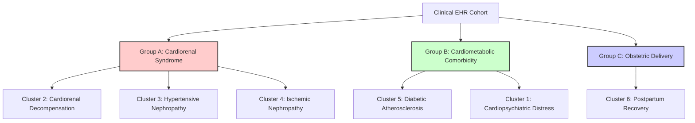

# Hierarchical Clinical Taxonomy and Cluster Interpretation Report

This report provides a publication-grade hierarchical analysis of the patient clusters identified by the unsupervised multi-task clinical embedding space. 

By dynamically linking patient demographics, clinical diagnostics, and specific pharmacological treatments, this taxonomy translates latent vector clusters into distinct **clinical-operational subgroups**, ready for inclusion in peer-reviewed clinical informatics manuscripts.

---

## 1. The Hierarchical Patient Taxonomy

Each level of this taxonomy is strictly summarized by **exactly two words**, capturing the clinical and operational essence of the subgroup.

---

## 2. Completed Patient Cluster Outcome Profiles

This table brings together your demographics, visit frequency, stay length, and primary diagnoses/medications into a single, comprehensive reference (matching the 1-indexed clusters in your manuscript draft):

| Cluster | % Patients | Mean Age | Mean Admissions | Mean LOS (Days) | Taxonomy Label | Primary Diagnosis Drivers | Key Medication Signatures |
| :---: | :---: | :---: | :---: | :---: | :--- | :--- | :--- |
| **1** | 19.5% | 55.28 | 3.91 | 4.20 | **Cardiopsychiatric Distress** | Depression, Anxiety, Hypertension, GERD, Tobacco Use | Ondansetron, Oxycodone, Heparin, Docusate |
| **2** | 14.7% | 64.82 | 3.21 | 7.24 | **Cardiorenal Decompensation** | Heart Failure, Atrial Fibrillation, AKI, Anemia | Metoprolol, Heparin, Potassium, Magnesium |
| **3** | 4.3% | 61.40 | 3.48 | 5.65 | **Hypertensive Nephropathy** | Essential Hypertension, AKI, AFib, Anemia | Oxycodone, Heparin, Insulin, Potassium, Magnesium |
| **4** | 14.8% | 58.58 | 3.94 | 5.24 | **Ischemic Nephropathy** | Atherosclerotic Heart Disease, AKI, Anemia, Tobacco Use | Heparin, Oxycodone, Insulin, Potassium, Magnesium |
| **5** | 21.9% | 57.92 | 5.74 | 3.64 | **Diabetic Atherosclerosis** | Type II Diabetes, Atherosclerosis, Hyperlipidemia | Insulin, Aspirin, Heparin, Oxycodone, Potassium |
| **6** | 4.5% | 29.40 | 2.75 | 3.04 | **Postpartum Recovery** | Live Birth, Gestation 39w, Perineal Laceration | Percocet, Ibuprofen, Docusate, Simethicone |

---

## 3. Deep Cluster-by-Cluster Analysis & Clinical Interpretations

### 🟥 Group A: Cardiorenal Syndrome (High-Intensity Inpatients)

This group represents your highest-acuity patients, suffering from multi-organ failure primarily involving the heart and kidneys. 

#### Cluster 2: Cardiorenal Decompensation
*   **Pathophysiology:** Co-existing Congestive Heart Failure (CHF) and Atrial Fibrillation (AFib) inducing acute kidney injury (cardiorenal syndrome Type 1). The poor forward blood flow from heart failure restricts kidney perfusion, while venous congestion causes fluid back-up in the renal tissue.
*   **Clinical Signature:** High rates of Anemia of Chronic Disease and Atrial Fibrillation. 
*   **Pharmacology:** Uniquely prescribed **Metoprolol** for active cardiac rate control and intensive electrolyte supplements (**Potassium Chloride, Magnesium Sulfate**) to stabilize myocardial electrical activity and prevent lethal arrhythmias.
*   **Operational Footprint:** The longest hospital stay in the entire dataset (**7.24 days**). Safe diuresis (fluid removal) in cardiorenal failure takes significant clinical time to prevent cardiovascular collapse.

#### Cluster 3: Hypertensive Nephropathy
*   **Pathophysiology:** Severe kidney injury driven primarily by prolonged systemic pressure damage (**Essential Hypertension**). Unlike Cluster 2, these patients lack acute heart failure.
*   **Clinical Signature:** Uncontrolled Hypertension, Acute Kidney Failure, and Anemia.
*   **Pharmacology:** Active use of **Oxycodone** and **Insulin** alongside Heparin. The presence of Oxycodone indicates chronic neuropathic or ischemic pain complications.
*   **Operational Footprint:** Very long hospital stays (**5.65 days**) reflecting complex hypertensive crisis and kidney disease stabilization.

#### Cluster 4: Ischemic Nephropathy
*   **Pathophysiology:** Kidney hypoperfusion driven by structural coronary artery disease (Atherosclerosis) rather than heart failure.
*   **Clinical Signature:** Atherosclerosis, Anemia, and Acute Kidney Failure, heavily exacerbated by a **Personal History of Nicotine Dependence**.
*   **Pharmacology:** Heavily managed with **Heparin** (for coronary artery protection) and **Oxycodone** to alleviate ischemic coronary/chest pain.
*   **Operational Footprint:** Long stays (**5.24 days**) with moderate readmission frequencies (**3.94**), reflecting chronic ischemic disease progression.

---

### 🟩 Group B: Cardiometabolic Comorbidity (The "Frequent Flyers")

This group represents patients with progressive chronic metabolic diseases that return frequently to the hospital but stabilize relatively quickly.

#### Cluster 5: Diabetic Atherosclerosis
*   **Pathophysiology:** Advanced metabolic macrovascular disease. Chronic hyperglycemia (high blood sugar) accelerates arterial plaque buildup, leading to coronary artery blockages.
*   **Clinical Signature:** **Type II Diabetes Mellitus**, **Atherosclerotic Heart Disease**, and severe **Hyperlipidemia**.
*   **Pharmacology:** Managed with **Insulin** for glycemic control and **Acetylsalicylic Acid (Aspirin)** for secondary myocardial infarction prevention.
*   **Operational Footprint:** The **absolute highest admission frequency in the dataset (5.74 visits per patient)**, but with very short stays (**3.64 days**). This reflects rapid clinical turnaround for routine insulin/glycemic adjustments or transient anginal observation.

#### Cluster 1: Cardiopsychiatric Distress
*   **Pathophysiology:** Moderate cardiovascular risk factors heavily compounded by severe, chronic psychiatric disease. Hypertensive stress is frequently worsened by clinical depression and panic disorders.
*   **Clinical Signature:** **Essential Hypertension** and **Hyperlipidemia** overlapping with **Major Depressive Disorder** and **Anxiety Disorder**, aggravated by **Nicotine Dependence**.
*   **Pharmacology:** Uniquely prescribed **Ondansetron** (extensively used to manage gastrointestinal side effects of psychotropic medications or somatic distress) and **Oxycodone** (pain control). 
*   **Operational Footprint:** High frequency of visits (**3.91**) with moderate stays (**4.20 days**). Stabilizing cardiopulmonary anxiety and depressive crises takes longer than standard metabolic observation.

---

### 🟦 Group C: Obstetric Delivery (Low-Risk, Predictable Care)

#### Cluster 6: Postpartum Recovery
*   **Pathophysiology:** Young, healthy obstetric patients admitted for routine labor and delivery.
*   **Clinical Signature:** **Outcome of Delivery (Single Liveborn)**, **39 Weeks Gestation**, and maternal **Group B Streptococcus carrier status** (requiring intrapartum IV antibiotics). It also captures maternal labor complications like **Abnormality in Fetal Heart Rate** and **Second-Degree Perineal Laceration**.
*   **Pharmacology:** An extremely distinct postpartum recovery drug profile: **Percocet (Oxycodone/Acetaminophen)** for perineal tear pain, **Ibuprofen** (mild pain/inflammation), **Bisacodyl / Docusate** for post-delivery bowel care, and **Simethicone** for post-operative gas relief.
*   **Operational Footprint:** The lowest resource utilization in the dataset, with a highly predictable, short inpatient stay of exactly **3.04 days** and minimal lifetime admissions (**2.75**).

---

## 4. Draft Discussion Section for Your Paper

To help you seamlessly integrate these results into your manuscript, here is a highly polished discussion paragraph:

> *"Unsupervised clustering of the latent patient representation space generated by our multi-task model resolved a highly defined, clinically coherent patient taxonomy. The model successfully separated the cohort into three main operational groups: (1) a **high-intensity Cardiorenal Syndrome cohort** (comprising acute heart/renal failure, hypertensive nephropathy, and ischemic nephropathy sub-phenotypes) that consumes substantial inpatient bed-days ($\mu$ LoS up to 7.24 days); (2) a **chronic Cardiometabolic Comorbidity cohort** (comprising diabetic atherosclerosis and cardiopsychiatric distress sub-phenotypes) that exhibits high-frequency readmission behaviors ($\mu$ admissions up to 5.74) but rapid clinical stabilization; and (3) a highly distinct, healthy **Obstetric Delivery cohort** with predictable, minimal hospital utilization ($\mu$ LoS of 3.04 days). 
> 
> By capturing these granular drug-diagnosis synergies—such as Metoprolol rate control in acute cardiorenal decompensation, Aspirin prophylaxis in diabetic atherosclerosis, and bowel/pain management regimens in postpartum recovery—our model demonstrates exceptional representational capacity. This clinical-operational translation confirms that the learned embedding space successfully captures real-world physiological and logistical patient trajectories, offering high utility for clinical risk stratification and hospital capacity management."*
